<h1>BastianWorld</h1>

BastianWorld to strona dla firmy zajmującej się serwisem komputerowym. Strona pozwala firmie na dodawanie usług/serwisów jakie wykonuje firma, zrobienia "ściany z certyfikatami" oraz prowadzenie bloga.

<h2>Funkcjonalności</h2>
<ul>
    <li>Dodawanie widoków usług/serwisów</li>
<li>Stworzenie strony z certyfikatami</li>
<li>Prowadzenie bloga</li>
</ul>

<h2>Technologie</h2>
<ul>
    <li>Django 3.x</li>
    <li>Python 3.x</li>
</ul>

<h2>Poniżej znajdują się zdjęcia z wiidoku przeglądarki</h2>

<h4>Widok strony głównej</h4>
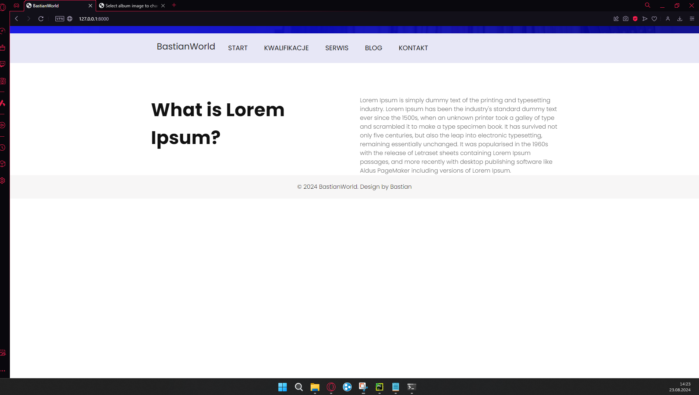
<h4>Strona z certyfikatami</h4>
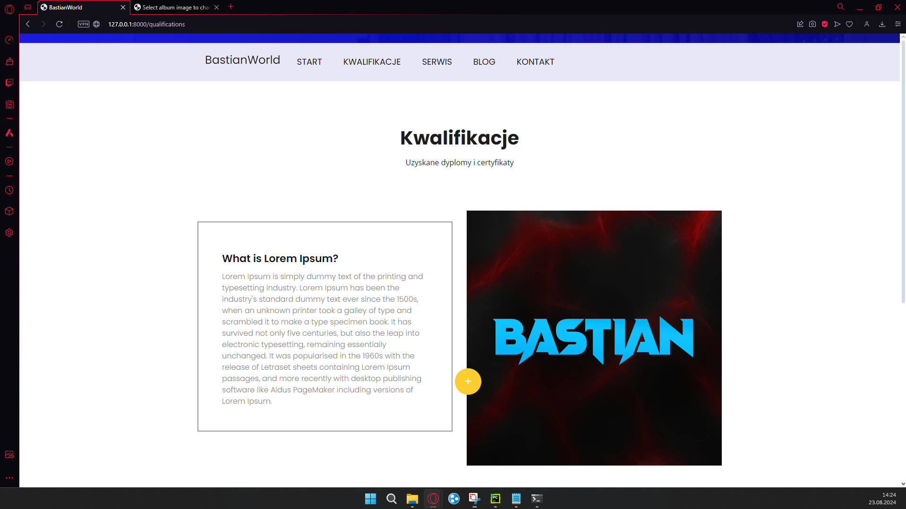
<h4>Widok strony z serwisami/usługami</h4>
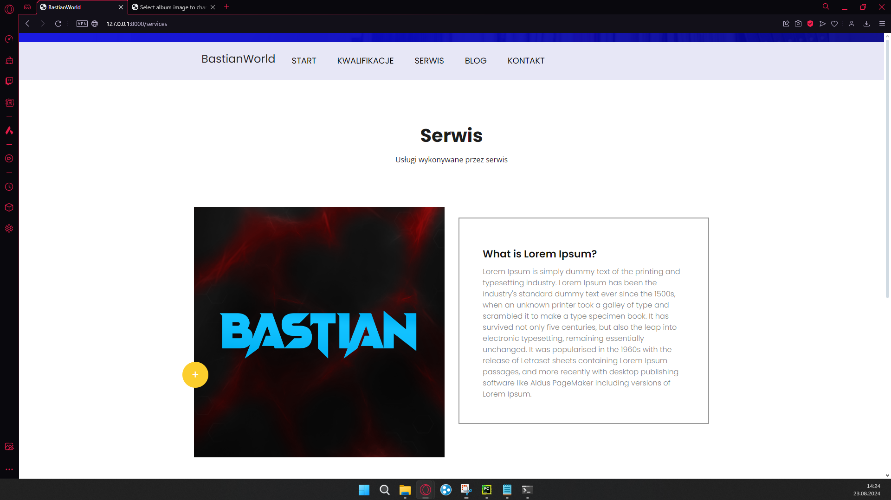
<h4>Strona z blogiem</h4>
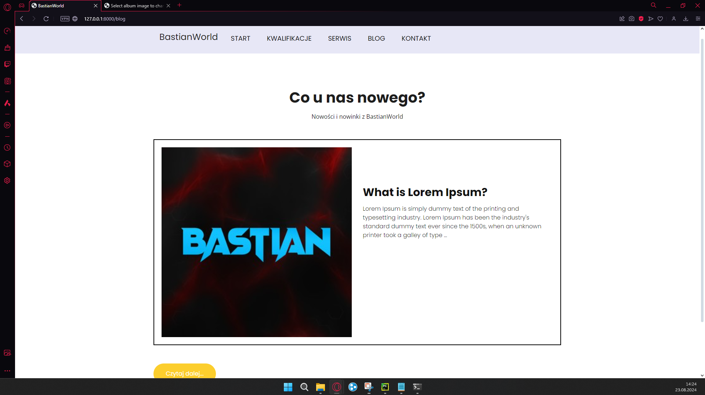
<h4>Widok ze szczegółami danego posta</h4>
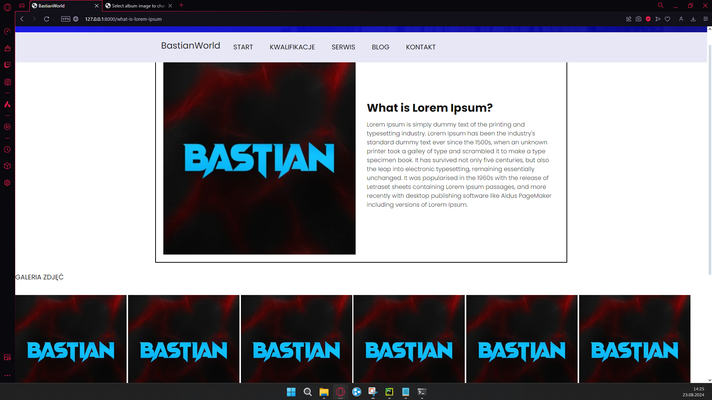
<h4>Strona ze informacjami firmy</h4>
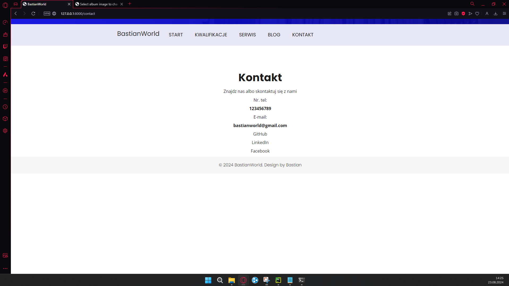
<h4>Widok z panelu administracyjnego - dodawanie posta na bloga</h4>
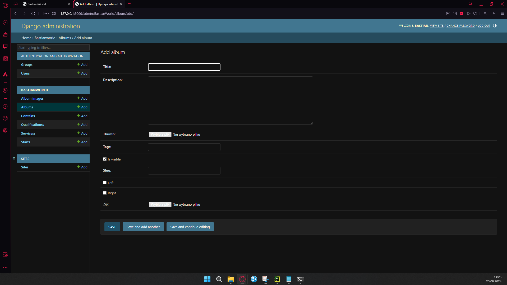
<h4>Widok z panelu administracyjnego - dodawanie informacji kontaktowych</h4>
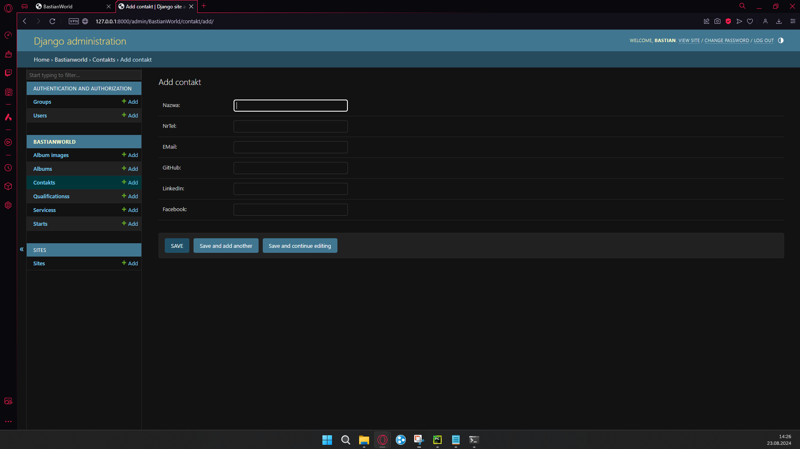
<h4>Widok z panelu administracyjnego - dodawanie certyfikatów</h4>
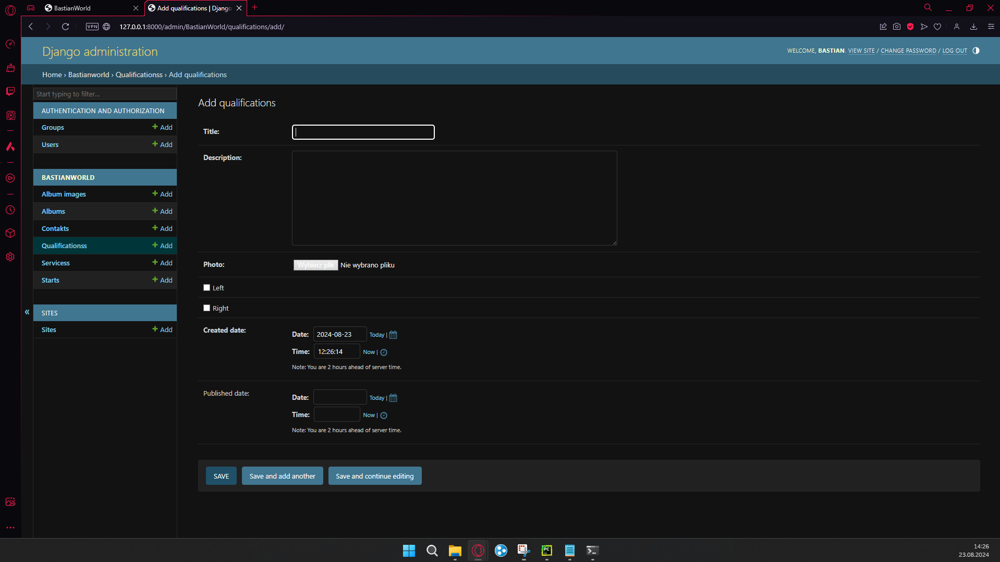
<h4>Widok z panelu administracyjnego - dodawanie usług/serwisów</h4>
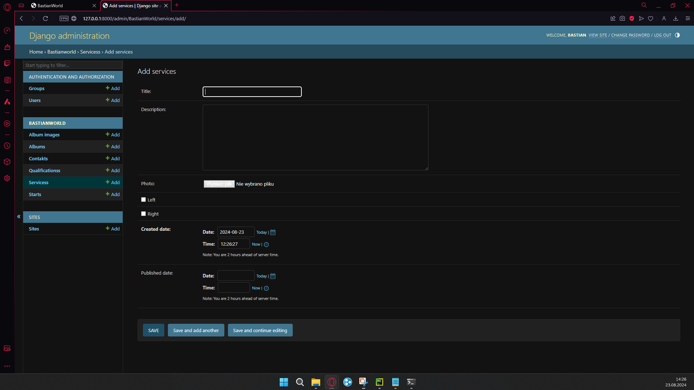
<h4>Widok z panelu administracyjnego - strona startowa</h4>
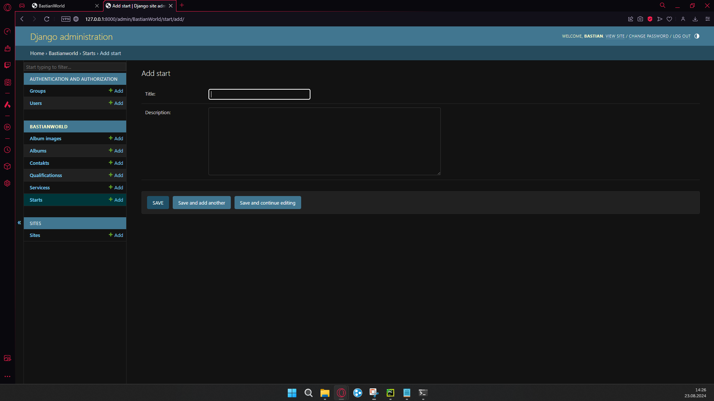
